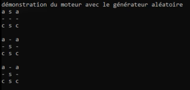
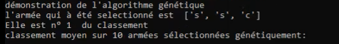
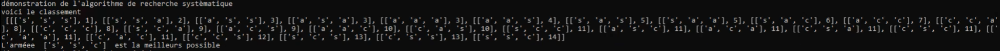
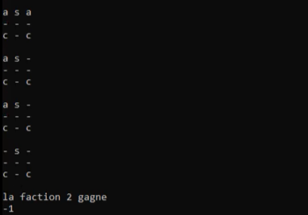

# Wargame

Le projet a été réalisé en 1ère année de licence informatique

Ceci n'est qu'une courte déscription et démonstration du projet.

### Présentation projet

Notre projet consiste en la création d'un algorithme d'optimisation pour un WarGame. Le
but de ce projet est de fournir un outil permettant d'aider à construire une armée efficace dans
une limite de points donnés. Le développement de notre projet s'est séparé en deux étapes.

Tout d'abord, nous avons conçu un moteur de combat entre deux armées avec des règles simples,
le but du projet n'étant pas la création d'un simulateur de bataille complexe, mais bien la
conception d'algorithmes permettant la génération d'armée.

Dans un second temps, nous avons implémenté plusieurs algorithmes permettant la génération
d'armée.

Nous avons réalisé ce projet à 2.

---
### Lancement du projet
python3 Main.py [taille de la grille] [1 pour la version graphique]
La version graphique c'est une version console avec affichage des batailles
Il est conseillé de mettre une taille inférieur ou égal a 4 car sinon ça prendra beaucoup de temps selon les 
ordinateurs.

### Fonctionnalité

Dans le cadre du projet, nous avons implémenté plusieurs fonctionnalités :
**1.** la conversion de grille de caractère en grille de personnage. Pour gagner du temps et pour
éviter plusieurs problèmes qui pourraient être inattendue, nous avons mis au point la
méthode suivante :
- Avant tout, nous créons une grille composée de chaînes de caractères. il y a un
caractère différent pour chaque unité suivie d'un chiffre correspondant à la faction
dans laquelle cette unité est, les factions ont pour chiffres 1 et 2, le 0 correspondant
à la faction attribuée aux cases vides. Les caractères correspondant aux unités sont
les suivants : le "s" pour le soldat, le "a" pour l'archer, le "c" pour le cavalier. Il reste
néanmoins la case vide à déffinir, elle est représentée par un espace (ce qui correspond
à " ").
- Ensuite, nous remplaçons tous les caractères par les personnages correspondants,
comme la grille devient illisible à partir de ce moment, nous utiliserons la fonction
afficherGrille qui rend lisible la grille remplis d'objet

**2.** la génération automatique de grilles. Cette fonctionnalité est utilisée par tous les algorithmes
de génération d'armée, elle place deux armées que nous avons données à chaque
extrémité d'une grille vide. Il faut cependant savoir que ce générateur de grille ne renvoie
qu'une grille de caractères, elle n'est pas utilisable avant d'avoir été convertie en grille de
personnages.

**3.** La gestion des personnages. Chaque personnage peut se déplacer et interagir avec les
autres personnages indépendamment. Il y a plusieurs types de fonctionnalités que les
personnages peuvent utiliser :
- Les personnages peuvent utiliser des capteurs pour repérer leurs ennemies, par
exemple un personnage peut savoir où est son ennemi le plus proche ou s'il 
suffisamment proche d'un ennemi pour l'attaquer.
- Ils peuvent aussi se déplacer sur la grille, le déplacement est assez simple, par exemple
si un personnage veut aller dans la case au-dessus de lui, alors il interagit avec la
grille pour savoir si la case devant lui est vide, si elle est vide alors ce personnage
est dupliqué sur la case correspondante et son ancienne case est remplacée par une
case vide.
- Il y a le combat, qui fait simplement diminuer le nombre de points de vie de l'ennemie
ciblée et si l'ennemie n'a plus de points de vie, alors il disparaît.
- Ensuite, les pénalités diminuent l'attaque et le nombre de points de vie du personnage
- Enfun il y a la mort du personnage, lorsqu'il n'a plus de point de vie, le personnage
se replace par une case vide en utilisant la fonction construitVide qui ne dépend
d'aucune classe

### Aléatoire
Cette démonstration illustre la création d'un schéma de configuration aléatoire d'une armée, grâce à un moteur de génération aléatoire. L'objectif est de montrer la disposition et les éléments générés par le moteur.

---

### Génétique

Cette démonstration montre le fonctionnement d'un algorithme génétique appliqué à une armée fictive. L'objectif de cet algorithme est d'évoluer et d'optimiser les armées par une série de sélections, mutations et croisements afin de trouver la meilleure configuration possible.

Nous affichons également la position de l'armée dans le classement pour voir si l'algorithme a été performant.

---

### Image 3 : Recherche Systematique

La recherche systematique liste toute les conbinaison selon un ou plusieurs critère données. 
Dans notre programme on limite a une taille de 3 la taille des armées pour avoir quelque chose de lisibible.

Cette démonstration utilise un algorithme de recherche systématique pour évaluer et classer différentes armées selon leur performance. Chaque armée est représentée par une combinaison de symboles, avec un score associé.

L'algorithme a identifié l'armée ['s', 's', 'c'] comme la meilleure possible dans cette configuration, atteignant un score élevé en termes d'optimisation.

---

### Fin d'un affrontement

Lorque 2 armée s'affronte on affiche l'armée gagnante à la fin.

## Conclusion
Nous avons tout au long du projet gagné beaucoup d'expérience grâce aux nombreuses
recherches et découvertes que nous avons réalisées. Nous avons remarqué que le travail de
groupe lors d'un projet n'est pas aussi simple que cela puisse paraître puisqu'il est diffcile de
savoir comment répartir le travail. En raison de l'absence des 2 autres membres du groupe,
notre organisation s'est simplifiée. Nous sommes contents d'avoir choisi et réalisé ce projet bien
qu'il n'ait pas atteint tous les objectifs que nous avions imaginés au début. Effectivement, nous
avions mis la barre trop haute, nous nous en sommes rendu compte grâce à l'intervention du
professeur. Lors de la conception, la partie qui nous a pris le plus de temps est la réalisation du
moteur du jeu en raison de sa complexité. Puis nous avons fait l'exploration systématique ainsi
que l'algorithme génétique assez facilement et rapidement. En raison d'un manque de temps,
nous n'avons pas pu améliorer notre algorithme génétique comme nous le souhaitions. En effet,
notre but, concernant l'algorithme génétique, était de pouvoir tester toute une population et
non pas deux individus à la fois, cela nous aurait permis d'accélérer notre algorithme. Durant
le projet, beaucoup de possibilités d'améliorations nous sont venues en tête, mais nous ne les
avons pas réalisées en raison du peu de temps que nous avions.
Voici la liste des améliorations que nous aurions aimé réaliser :
- Ajouter plusieurs nouvelles unités
- Ajouter un système de moral sur les armées
- pouvoir imposer au générateur d'armée des règles pour le rendre plus efficace, par exemple,
éviter de mettre un archer en première ligne
- les soldats deviennent moins fort après qu'un combat soit finis en raison de l'épuisement
- Ajouter un leader qui donne différents bonus
On peut aussi mentionner notre manque d'expérience au début du projet et donc du manque
d'efficacité des premières fonctions qu'on a fait notamment par rapport à la grille.